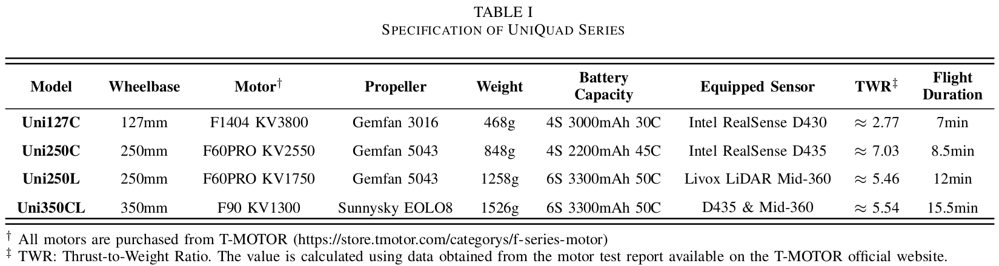
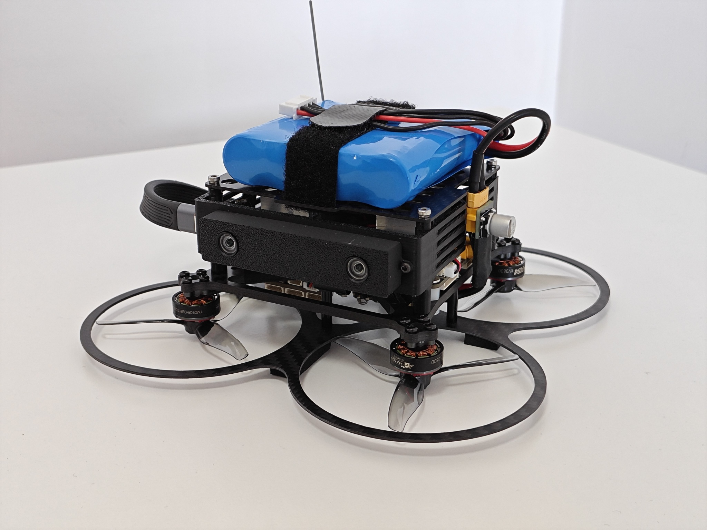
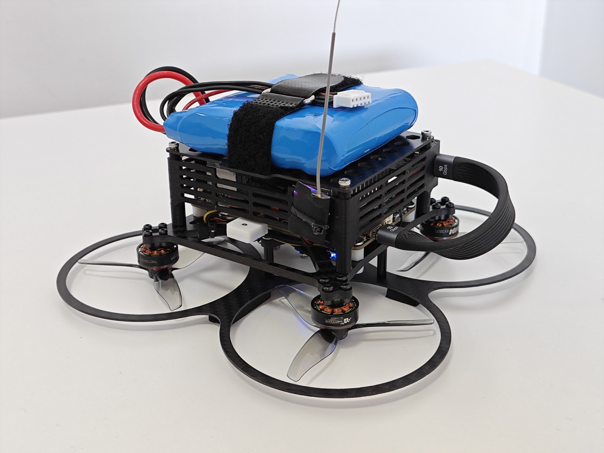
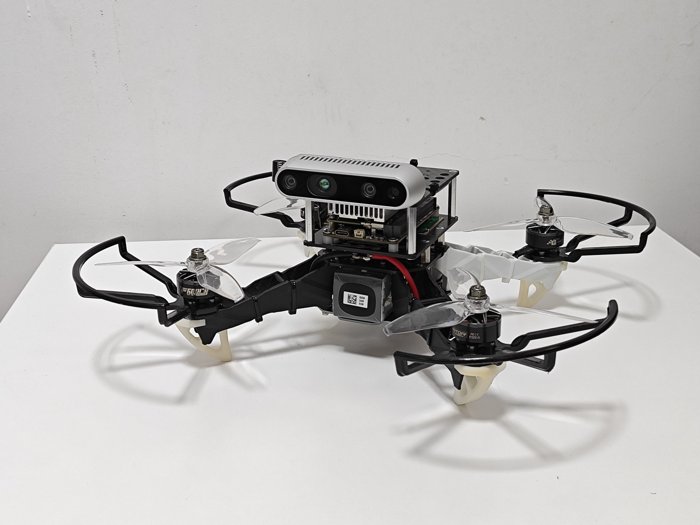
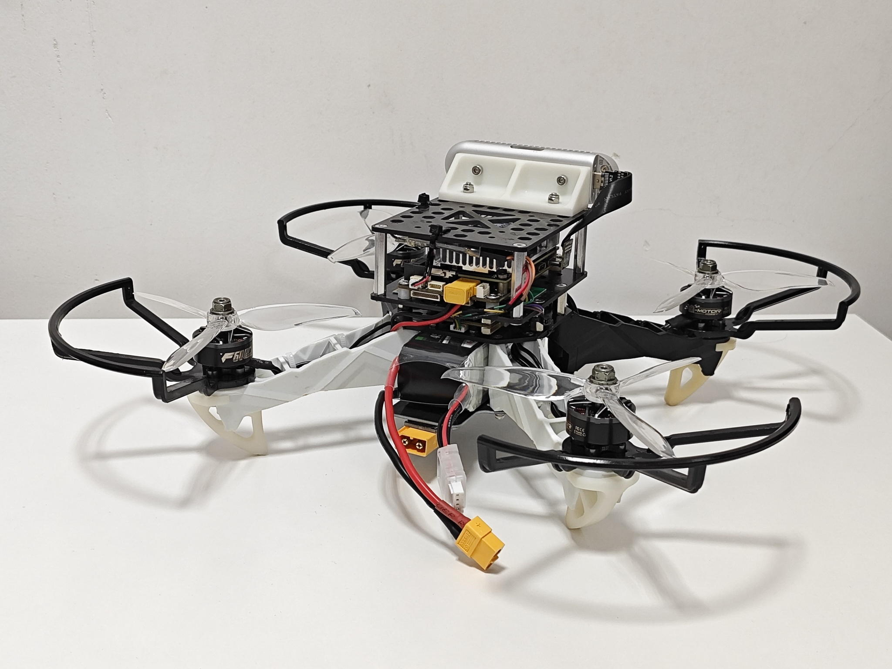
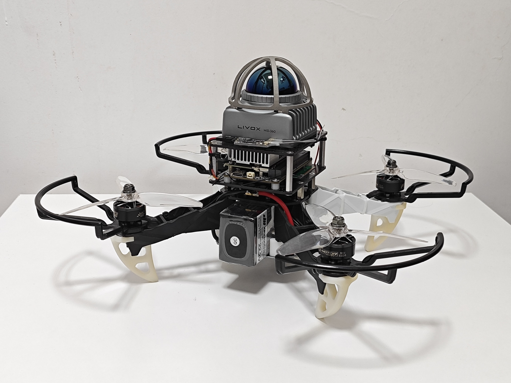
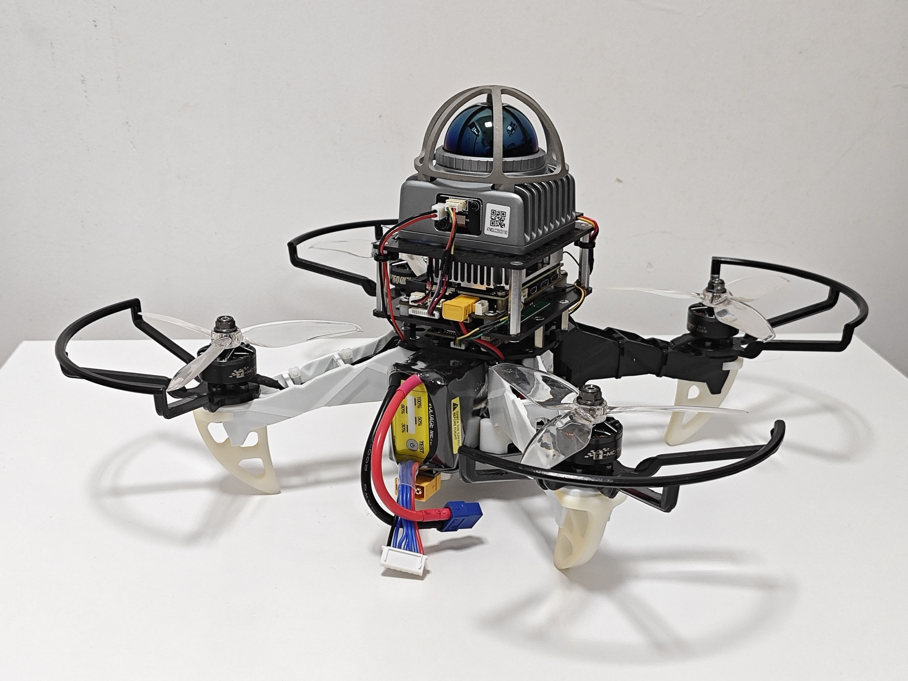
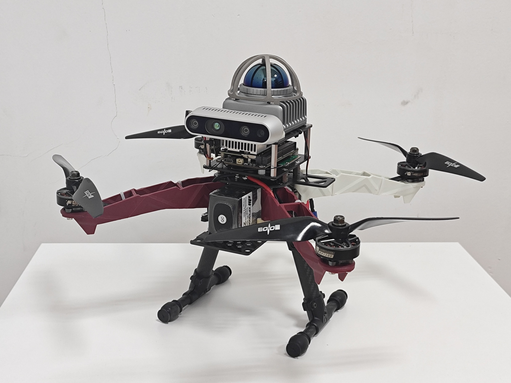
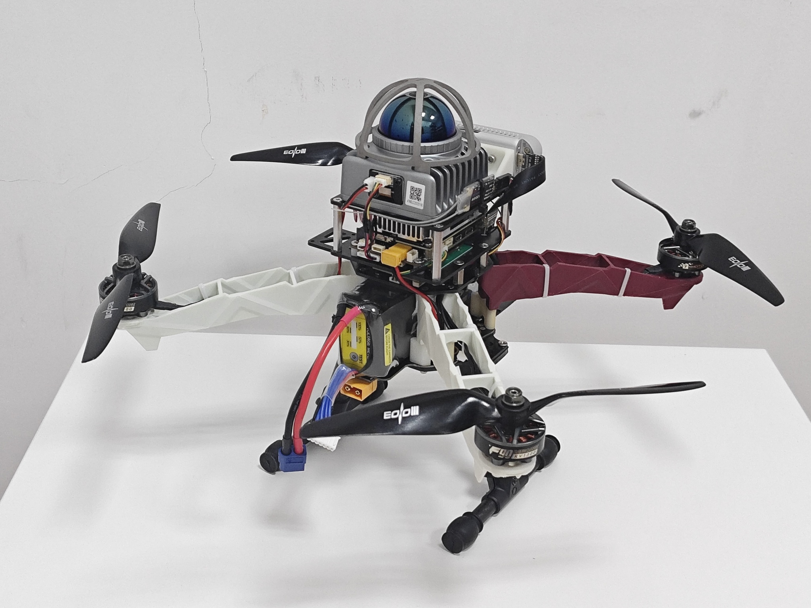

    <h2>UniQuad: A Unified and Versatile Quadrotor Platform Series for UAV Research and Application</h2>
     
        <a href="https://yzhangec.github.io/" target="_blank">Yichen Zhang</a>†,
        <a href="https://github.com/xchencq" target="_blank">Xinyi Chen</a>,
        <a href="https://github.com/Peize-Liu" target="_blank">Peize Liu, </a>,
        <a href="https://github.com/coopjz" target="_blank">Junzhe Wang</a>,
        <a href="https://github.com/JXNCTED" target="_blank">Hetai Zou</a>,
        <a href="http://zju-fast.com/neng-pan/" target="_blank">Neng Pan</a>,
        <a href="http://zju-fast.com/fei-gao/" target="_blank">Fei Gao</a>,
        <a href="https://uav.hkust.edu.hk/group/" target="_blank">Shaojie Shen</a>
    

        <h45>
            HKUST Aerial Robotics Group, ZJU FAST Lab
             
        </h5>
        †Corresponding Author
    

    
    
    <!--  -->
    <!--  -->

## Updates
* **04 Jul 2024**: Project website published. All CAD models with online preview and essential components can be downloaded from the website.
* **29 Jun 2024**: Submitted to ICRA@40

Please kindly star ⭐ this project if it helps you. We take great efforts to develope and maintain it 😁.

## Collection Photo of UniQuad Series

    

The example quadrotor platforms in **UniQuad** series provided in this article, namely **Uni250L**, **Uni127C**, **Uni350CL** and **Uni250C** from left to right. Note that these four models merely serve as examples of the platform series, which can be further extended and customized on your own choice.

## Detailed Information

    

    
    
     
    Front and back view of Uni127C quadrotor platform 1

    
    
     
    Front and back view of Uni250C quadrotor platform.

    
    
     
    Front and back view of Uni250L quadrotor platform.

    
    
     
    Front and back view of Uni350CL quadrotor platform.

1. Uni127C was inspired and adapted to UniQuad framework by the design from <a href="https://arxiv.org/abs/2403.04586" target="_blank"> Learning Agility Adaptation for Flight in Clutter</a>, which is credit to its designer <a href="http://zju-fast.com/neng-pan/" target="_blank">Neng Pan</a>. 

## Useful Links

    <ol>
        <li>
            realsense-ros: ROS Wrapper for Intel(R) RealSense(TM) Cameras,
            <a href="https://github.com/IntelRealSense/realsense-ros" target="_blank">https://github.com/IntelRealSense/realsense-ros</a>
        </li>
        <li>
            librealsense: Intel® RealSense™ SDK,
            <a href="https://github.com/IntelRealSense/librealsense" target="_blank">https://github.com/IntelRealSense/librealsense</a>
        </li>
        <li>
            Livox-SDK,  Livox-SDK2, livox_ros_driver, livox_ros_driver2: 
            <a href="https://github.com/Livox-SDK" target="_blank">https://github.com/Livox-SDK</a>
        </li>
        <li>
            VINS-Fusion: An optimization-based multi-sensor state estimator, 
            <a href="https://github.com/HKUST-Aerial-Robotics/VINS-Fusion" target="_blank">https://github.com/HKUST-Aerial-Robotics/VINS-Fusion</a>
        </li>
        <li>
            FAST_LIO: A computationally efficient and robust LiDAR-inertial odometry (LIO) package, 
            <a href="https://github.com/hku-mars/FAST_LIO" target="_blank">https://github.com/hku-mars/FAST_LIO</a>
        </li>
        <li>
            Fast-Planner: A Robust and Efficient Trajectory Planner for Quadrotors, 
            <a href="https://github.com/HKUST-Aerial-Robotics/Fast-Planner" target="_blank">https://github.com/HKUST-Aerial-Robotics/Fast-Planner</a>
        </li>
        <li>
            px4ctrl:
            <a href="https://github.com/ZJU-FAST-Lab/Fast-Drone-250/tree/master/src/realflight_modules/px4ctrl" target="_blank">https://github.com/ZJU-FAST-Lab/Fast-Drone-250/tree/master/src/realflight_modules/px4ctrl</a>
    </ol>

## Acknowledgements

    <ol>
        <li>
            Nxt-FC: Mini PX4 for UAV Group, 
            <a href="https://github.com/HKUST-Aerial-Robotics/Nxt-FC" target="_blank">https://github.com/HKUST-Aerial-Robotics/Nxt-FC</a>
        </li>
        <li>
            ZJU Fast-Drone-250:
            <a href="https://github.com/ZJU-FAST-Lab/Fast-Drone-250" target="_blank">https://github.com/ZJU-FAST-Lab/Fast-Drone-250</a>
        </li>
    </ol>

