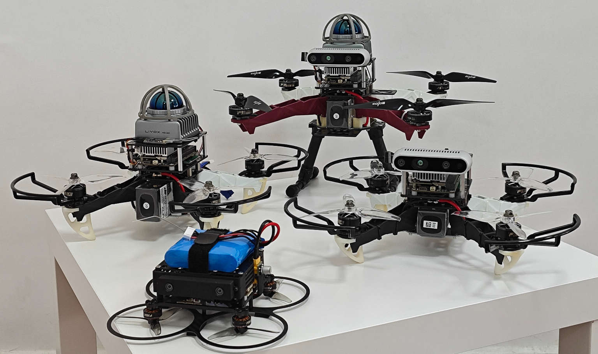

    <h2>UniQuad: A Unified and Versatile Quadrotor Platform Series for UAV Research and Application</h2>
     
        <a href="https://yzhangec.github.io/" target="_blank">Yichen Zhang</a>†,
        <a href="https://uav.hkust.edu.hk/current-members/" target="_blank">Xinyi Chen</a>,
        <a href="https://uav.hkust.edu.hk/current-members/" target="_blank">Peize Liu, </a>,
        <a href="https://github.com/coopjz" target="_blank">Junzhe Wang</a>,
        <a href="https://github.com/JXNCTED" target="_blank">Hetai Zou</a>,
        <a href="https://uav.hkust.edu.hk/group/" target="_blank">Shaojie Shen</a>
    

        <h45>
            HKUST Aerial Robotics Group &nbsp;&nbsp;
             
        </h5>
        †Corresponding Author
    

    
    
    <!--  -->
    <!--  -->

## Updates
* **04 Jul 2024**: Project website published
* **29 Jun 2024**: Submitted to ICRAX40

## Collection Photo of UniQuad Series

    

The example quadrotor platforms in **UniQuad** series provided in this article, namely **Uni250L**, **Uni127C**, **Uni350CL** and **Uni250C** from left to right. Note that these four models merely serve as examples of the platform series, which can be further extended and customized on your own choice.